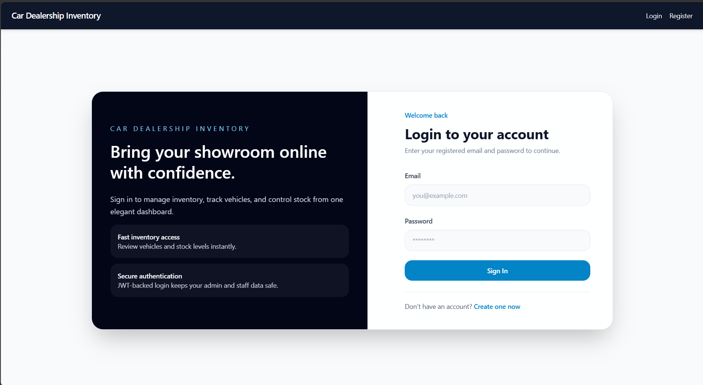
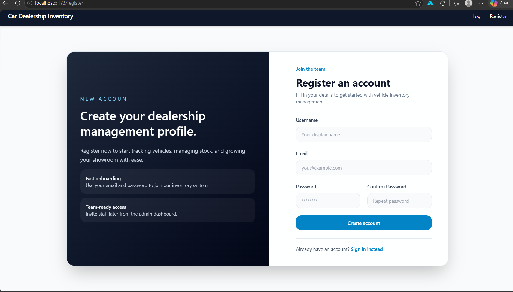
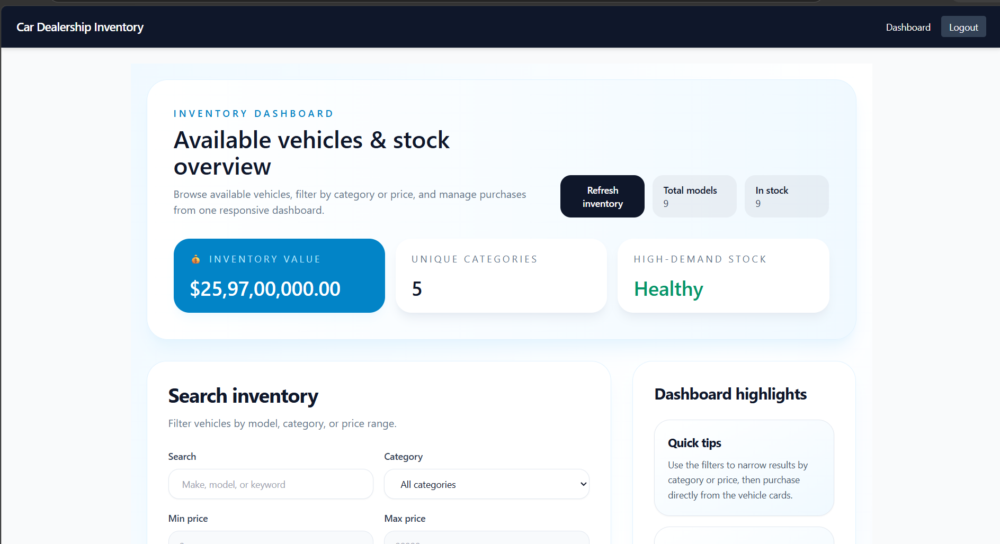
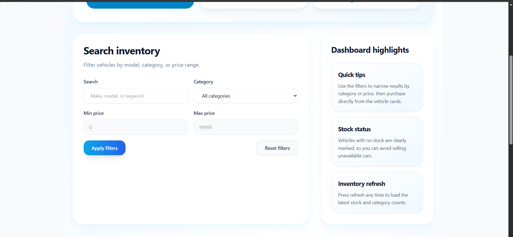
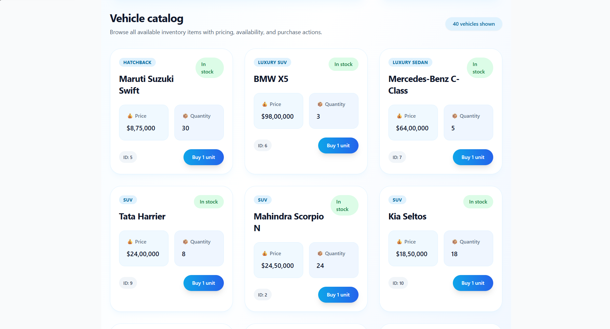
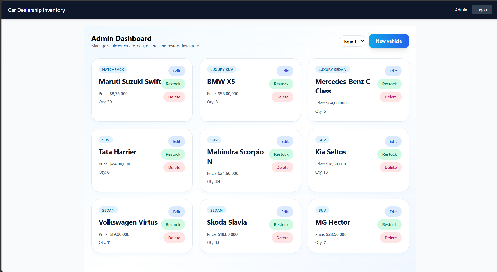
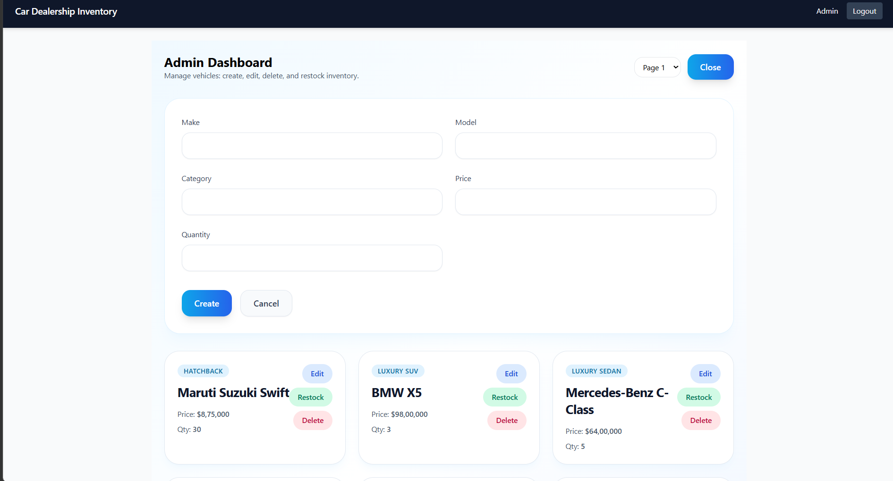

# 🚗 Car Dealership Inventory System

## 📖 Project Overview

A modern full-stack **Car Dealership Inventory Management System** that provides a complete solution for managing vehicle stock, sales, and administrative operations. Built with a RESTful backend API and a responsive React frontend, the application supports two distinct user interfaces:

### 👥 Customer Dashboard
- **Browse Inventory** – View the complete catalog of available vehicles with real-time stock levels
- **Advanced Search** – Filter vehicles by make, model, category (Sedan, SUV, Truck, Coupe, Hatchback), and price range
- **Purchase Vehicles** – Buy available units with instant stock updates
- **Stock Visibility** – See clear in-stock/out-of-stock indicators for each vehicle
- **Pagination** – Navigate large inventories efficiently with page-based controls

### 🔐 Admin Dashboard
- **Create Vehicles** – Add new inventory items with make, model, category, price, and initial stock
- **Update Inventory** – Modify vehicle details and pricing
- **Delete Vehicles** – Remove discontinued models from the system
- **Restock** – Increase vehicle quantities when new stock arrives
- **Full CRUD Operations** – Comprehensive management interface with form validation and success/error feedback

The system implements role-based access control (RBAC) with JWT authentication, ensuring that administrative functions are restricted to admin users while customers can browse and purchase freely.

---

## 🛠️ Tech Stack

### Backend
- **Java 17** – Modern LTS version with pattern matching and records
- **Spring Boot 3.3.4** – Enterprise-grade framework with auto-configuration
- **Spring Security** – JWT-based authentication and authorization
- **Spring Data JPA** – ORM with PostgreSQL
- **PostgreSQL** – Robust relational database
- **Flyway** – Database versioning and migrations
- **ModelMapper** – Entity-to-DTO mapping
- **Lombok** – Boilerplate reduction
- **Maven** – Dependency management and build automation

### Frontend
- **React 18** – Component-based UI with hooks
- **Vite** – Lightning-fast build tool and dev server
- **Tailwind CSS** – Utility-first styling framework
- **React Router** – Client-side routing and navigation
- **Axios** – HTTP client with interceptors for JWT handling
- **Vitest** – Fast unit testing framework
- **React Testing Library** – User-centric component testing

---

## 📁 Project Structure

```
Car_Dealership_Inventory/
├── Server/                                          # Spring Boot REST API
│   ├── pom.xml
│   ├── .gitignore
│   └── src/
│       ├── main/
│       │   ├── java/com/dealership/inventory/
│       │   │   ├── config/                # Security, CORS, bean configuration
│       │   │   ├── controller/            # REST controllers (Auth, Vehicle, Admin)
│       │   │   ├── dto/
│       │   │   │   ├── request/           # Request payload DTOs
│       │   │   │   └── response/          # Response payload DTOs
│       │   │   ├── entity/                # JPA entities (User, Vehicle)
│       │   │   ├── repository/            # Spring Data JPA repositories
│       │   │   ├── service/               # Service interfaces
│       │   │   │   └── impl/              # Service implementations
│       │   │   ├── security/              # JWT filter, provider, UserDetailsService
│       │   │   └── exception/             # Custom exceptions + global handler
│       │   └── resources/
│       │       ├── application.yml        # Default profile config
│       │       ├── application-dev.yml    # Dev profile (git-ignored)
│       │       └── db/migration/           # Flyway SQL migrations
│       └── test/
│           ├── java/com/dealership/inventory/
│           │   ├── controller/            # @WebMvcTest slice tests
│           │   ├── service/               # Unit tests (Mockito)
│           │   ├── repository/            # @DataJpaTest slice tests
│           │   ├── mapper/                # ModelMapper unit tests
│           │   ├── security/              # JWT and auth security tests
│           │   └── integration/           # Full Spring Boot context tests
│           └── resources/application-test.yml
│
└── Client/                                          # React SPA
    ├── package.json
    ├── vite.config.js
    ├── tailwind.config.js
    ├── postcss.config.js
    └── src/
        ├── api/                           # Axios client + endpoint wrappers
        │   ├── axiosClient.js
        │   ├── authApi.js
        │   └── vehicleApi.js
        ├── components/
        │   ├── auth/                       # Authentication UI (HeroPanel, AuthLayout)
        │   ├── layout/                     # Navbar, ProtectedRoute
        │   ├── vehicles/                   # VehicleCard, VehicleList, VehicleForm
        │   └── common/                     # Reusable UI primitives
        ├── pages/                          # Login, Register, Dashboard, Admin, NotFound
        ├── context/                        # AuthContext (JWT session state)
        ├── hooks/                          # useVehicles, useAuth
        ├── tests/                          # Vitest setup + component tests
        ├── utils/                          # Constants, validators
        ├── App.jsx
        ├── main.jsx
        └── index.css
```

---

## 🚀 Getting Started

### Prerequisites

Before running the project, ensure the following are installed on your machine:

| Tool | Minimum Version | Purpose |
|------|----------------|---------|
| Java | 17+ | Backend runtime |
| Maven | 3.9+ | Backend build tool |
| Node.js | 18+ | Frontend runtime |
| npm | 9+ | Frontend package manager |
| PostgreSQL | 14+ | Database |

---

### Database Setup

#### Option A: Local PostgreSQL Installation

1. Start your PostgreSQL service
2. Create the database:
   ```sql
   CREATE DATABASE dealership_inventory;
   ```

### Backend Setup (Server)

1. **Clone and navigate to the backend directory:**
   ```bash
   git clone <your-repo-url>
   cd Car_Dealership_Inventory/Server
   ```

2. **Configure database credentials:**
   Navigate to the resources folder and create your local config:
   ```bash
   cd Server/src/main/resources
   cp application-dev.yml.example application-dev.yml
   ```
   Edit `application-dev.yml` with your actual database connection string, username, and password. This file is listed in `.gitignore` and will never be committed.

   Alternatively, set environment variables:
   ```bash
   export DB_USERNAME=your_username
   export DB_PASSWORD=your_password
   export JWT_SECRET=your-long-random-secret-key-here
   ```

3. **Run the application:**
   ```bash
   # On Linux/macOS
   ./mvnw spring-boot:run

   # On Windows
   mvnw.cmd spring-boot:run
   ```
   The API will start on **http://localhost:8080**

4. **Run backend tests:**
   ```bash
   # On Linux/macOS
   ./mvnw test

   # On Windows
   mvnw.cmd test
   ```

5. **Access H2 Console (for testing without PostgreSQL):**
   The application is configured with an H2 in-memory database for tests. To use it, modify `application-test.yml` or specify the `test` profile.

---

### Frontend Setup (Client)

1. **Navigate to the frontend directory and install dependencies:**
   ```bash
   cd Car_Dealership_Inventory/Client
   npm install
   ```

2. **Configure environment variables:**
   Copy `.env.example` to `.env` and adjust if needed:
   ```
   VITE_API_BASE_URL=http://localhost:8080/api
   ```

3. **Start the development server:**
   ```bash
   npm run dev
   ```
   The application will be available at **http://localhost:5173**

4. **Run frontend tests:**
   ```bash
   # Run tests once
   npm test

   # Run tests in watch mode
   npm run test:watch

   # Run tests with coverage
   npm run test:coverage
   ```

5. **Build for production:**
   ```bash
   npm run build
   ```

---

## 🔌 API Overview

| Method | Endpoint | Description | Authentication |
|--------|---------|-------------|----------------|
| `POST` | `/api/auth/register` | Register a new user | None |
| `POST` | `/api/auth/login` | Authenticate and receive JWT | None |
| `GET` | `/api/vehicles` | List all available vehicles (paginated) | JWT Token |
| `GET` | `/api/vehicles/search` | Search by make/model/category/price | JWT Token |
| `POST` | `/api/vehicles` | Add a new vehicle | JWT Token |
| `PUT` | `/api/vehicles/{id}` | Update a vehicle | JWT Token |
| `DELETE` | `/api/vehicles/{id}` | Delete a vehicle | Admin Only |
| `POST` | `/api/vehicles/{id}/purchase` | Purchase a vehicle (decrement stock) | JWT Token |
| `POST` | `/api/vehicles/{id}/restock` | Restock a vehicle (increment stock) | Admin Only |

---

## 📸 Application Screenshots

The following screenshots demonstrate the main features and user interface of the **Car Dealership Inventory System**.

> **Note:** All screenshots are available in the [`screenshots/`](./screenshots/) directory.

### 🔐 Authentication

#### Login Page


#### Register Page


---

### 👤 User Dashboard

#### Dashboard Overview


#### Vehicle Inventory


#### Vehicle Details


---

### 👨‍💼 Admin Dashboard

#### Admin Dashboard Overview


#### Vehicle Management


## 🧪 Test Report

### Backend Test Results (JUnit 5 + Mockito + Spring Boot Test)

All backend tests were executed using Maven Surefire. Results are categorized by test type:

#### Unit Tests – Service Layer

| Test Class | Tests Run | Failures | Errors | Status |
|-----------|-----------|----------|--------|--------|
| `AuthServiceImplTest` | 9 | 0 | 0 | ✅ PASS |
| `AdminServiceImplTest` | 2 | 0 | 0 | ✅ PASS |
| `VehicleServiceImplTest` | 4 | 0 | 0 | ✅ PASS |
| `VehicleServiceCrudSearchTest` | 18 | 0 | 0 | ✅ PASS |
| `VehicleServiceSecurityTest` | 1 | 0 | 0 | ✅ PASS |

#### Unit Tests – Security Layer

| Test Class | Tests Run | Failures | Errors | Status |
|-----------|-----------|----------|--------|--------|
| `JwtServiceTest` | 7 | 0 | 0 | ✅ PASS |
| `JwtAuthFilterTest` | 6 | 0 | 0 | ✅ PASS |
| `UserDetailsServiceImplTest` | 2 | 0 | 0 | ✅ PASS |

#### Unit Tests – Repository & Mapper

| Test Class | Tests Run | Failures | Errors | Status |
|-----------|-----------|----------|--------|--------|
| `UserRepositoryTest` | 6 | 0 | 0 | ✅ PASS |
| `VehicleRepositoryTest` | 1 | 0 | 0 | ✅ PASS |
| `VehicleMapperTest` | 2 | 0 | 0 | ✅ PASS |

#### Slice Tests – Controllers

| Test Class | Tests Run | Failures | Errors | Status |
|-----------|-----------|----------|--------|--------|
| `AuthControllerTest` | 13 | 0 | 0 | ✅ PASS |
| `VehicleControllerTest` | 7 | 0 | 0 | ✅ PASS |
| `AdminControllerTest` | 3 | 0 | 0 | ✅ PASS |

#### Integration Tests

| Test Class | Tests Run | Failures | Errors | Status |
|-----------|-----------|----------|--------|--------|
| `AuthRegistrationIntegrationTest` | 5 | 0 | 0 | ✅ PASS |
| `AuthLoginIntegrationTest` | 4 | 0 | 0 | ✅ PASS |
| `AdminRegisterAdminIntegrationTest` | 3 | 0 | 0 | ✅ PASS |
| `VehicleCreationIntegrationTest` | 4 | 0 | 0 | ✅ PASS |

#### Application Load Test

| Test Class | Tests Run | Failures | Errors | Status |
|-----------|-----------|----------|--------|--------|
| `InventoryApplicationTests` | 1 | 0 | 0 | ✅ PASS |

### Summary

```
Backend Test Summary
─────────────────────
Total Tests Run:   102
Failures:          0
Errors:            0
Skipped:           0
Success Rate:      100%
```


## 🤖 My AI Usage

### How They Were Used
1. **Backend Architecture** – AI was used to design and implement the layered Spring Boot architecture (Controllers → Services → Repositories), including DTOs, entity mappings, and Flyway migrations.
2. **Security Implementation** – AI assisted in implementing JWT authentication with Spring Security, including filters, token providers, and role-based access control.
3. **Service Layer Logic** – AI helped write business logic for vehicle CRUD operations, purchase/restock mechanics, and admin functions with proper exception handling.
4. **Frontend Development** – AI contributed to building React components, context providers for auth state, Axios interceptors, and Tailwind-styled UI pages.
5. **Testing Strategy** – AI guided the creation of unit tests (Mockito), slice tests (`@WebMvcTest`, `@DataJpaTest`), and integration tests using H2.
6. **Documentation** – AI helped structure and refine this README, ensuring clarity for setup, testing, and API usage.

### Reflection
AI tools significantly accelerated development by:
- Reducing boilerplate coding time for repetitive patterns (getters/setters via Lombok, DTO mappers)
- Quickly generating test scaffolding and mocking strategies
- Providing instant feedback on Spring configuration and security best practices
- Helping debug JWT filter chains and CORS issues

However, every generated solution was reviewed and adapted to fit project-specific requirements. The AI served as a force multiplier for implementation speed while architectural decisions and code quality remained in human hands.

---

## 📦 Database Configuration

The project uses **PostgreSQL** for production and **H2** for testing. Flyway handles schema migrations located in `Server/src/main/resources/db/migration/`. The initial schema creates `users` and `vehicles` tables with proper constraints and indexes.

### Environment Variables

| Variable | Description | Required |
|----------|-------------|----------|
| `DB_URL` | PostgreSQL JDBC connection string | No |
| `DB_USERNAME` | Database username | No |
| `DB_PASSWORD` | Database password | Yes |
| `JWT_SECRET` | Secret key for JWT signing | Yes |
| `VITE_API_BASE_URL` | Frontend API endpoint | Yes |

---

## 📝 License

This project is created for educational and demonstration purposes.
